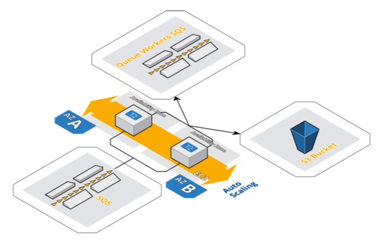

# Logo Resizer Service 

With logo-resizer service, we rescale user-uploaded stock images and store them in the S3 bucket.
With each page load, they will be loaded directly from the S3.

After the *stock-symbol service* puts the image logo in a queue:

1. Logo-resizer pulls the message with an image from the SQS.
2. Retrieves the named file.
3. Resizes the image.
4. Stores the image to the S3 bucket.
5. Writes *Task Complete* message back to the queue.
6. Puts the logo URL into another queue for *queue-workers*.
7. Deletes the original task message.
8. Checks for more messages in the queue.

We resize the logo and store in memory as BytesIO without writing to disk. To make it accessible as an image file for everyone, we have explicitly changed its content- type and access control lists to the public read. Otherwise, it would remain as binary/octet-stream in the bucket, and the content of the image would be hidden without downloading it beforehand.

